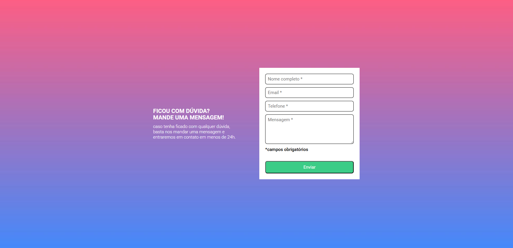

# 📌 Formulário com Validação em JavaScript
Este é um projeto de **formulário com validação**, desenvolvido com **HTML, CSS e JavaScript puro**. O formulário verifica se todos os campos obrigatórios foram preenchidos antes de permitir o envio.

## 📷 Preview

### 💻 Versão Web


## ✨ Tecnologias Utilizadas

- **HTML5** → Estrutura do formulário
- **CSS3** → Estilização e feedback visual
- **JavaScript** → Validação do formulário

## 📌 Funcionalidades

✔️ Validação em **JavaScript puro**  
✔️ Exibição de mensagens de erro  
✔️ Destacar campos inválidos com **borda vermelha**  
✔️ Feedback visual dinâmico para o usuário  

## 🚀 Demonstração

🔗 **Acesse o projeto aqui**: (https://milaregner.github.io/formulario-com-validacao/)

## 🚀 Como executar o projeto

1. Clone este repositório:
   ```bash
   git clone https://github.com/Milaregner/formulario-com-validacao
   ```
2. Acesse a pasta do projeto:
   ```bash
   cd nome-do-projeto
   ```
3. Abra o arquivo `index.html` no navegador.

## 📌 Melhorias Futuras

- Melhorar a acessibilidade e reponsividade
- Adicionar animações para melhor experiência do usuário
- Implementar validação adicional com expressões regulares

## 💜 Criado por

Feito com 💜 por [@Milaregner](https://github.com/Milaregner).  
Se gostou do projeto, deixe uma ⭐ no repositório!

---

💡 *Sugestões e melhorias são sempre bem-vindas!*